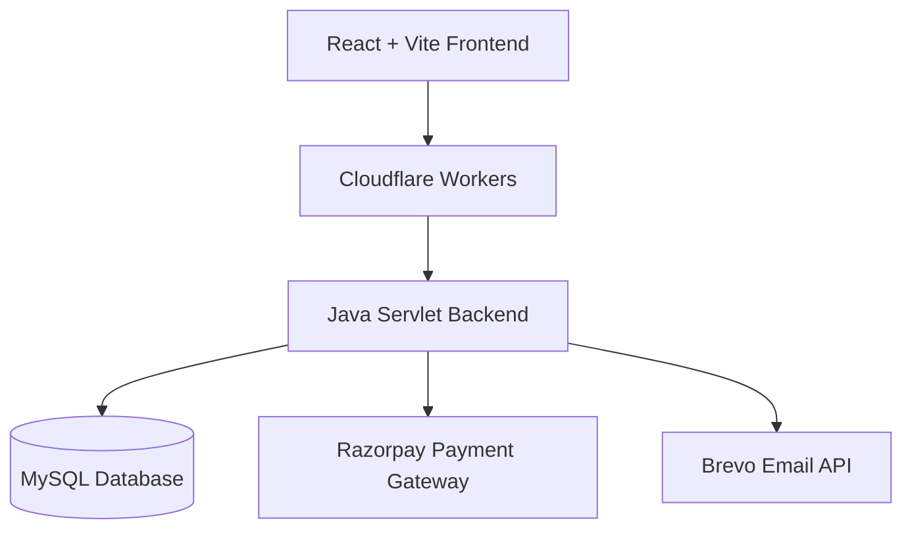
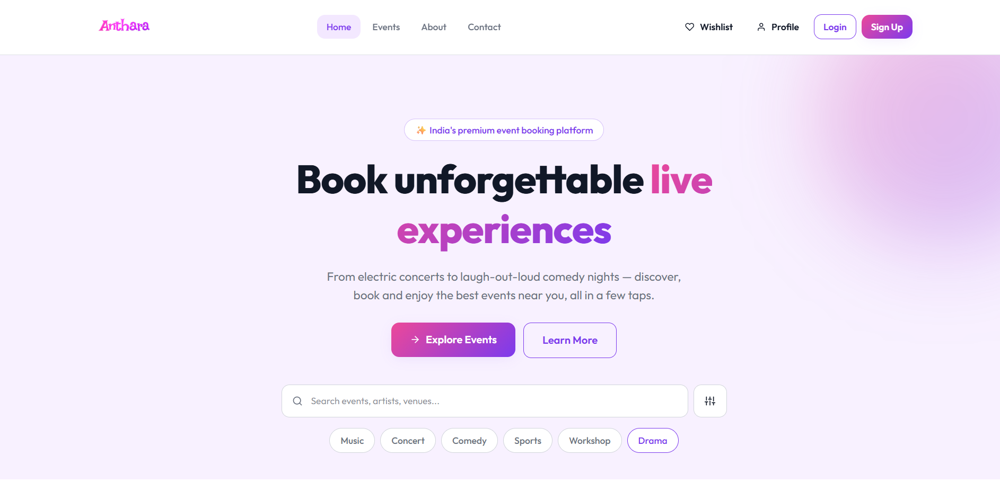
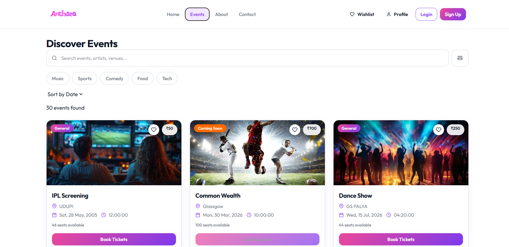
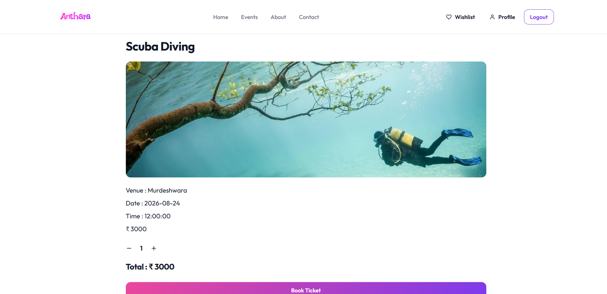
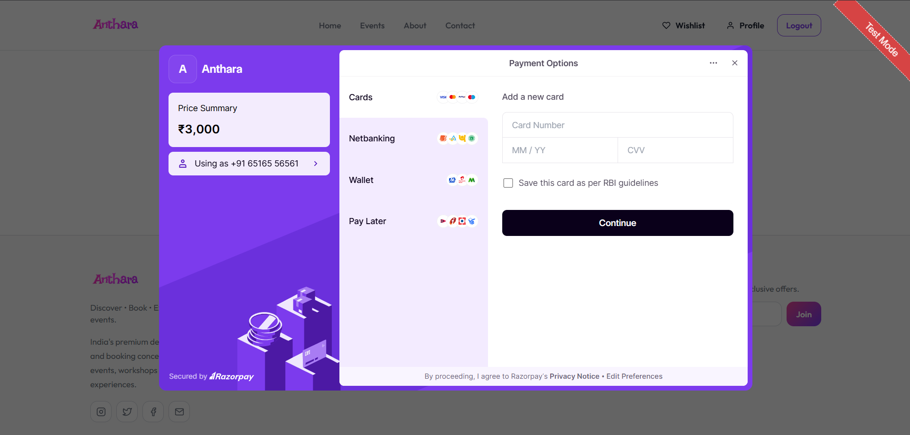
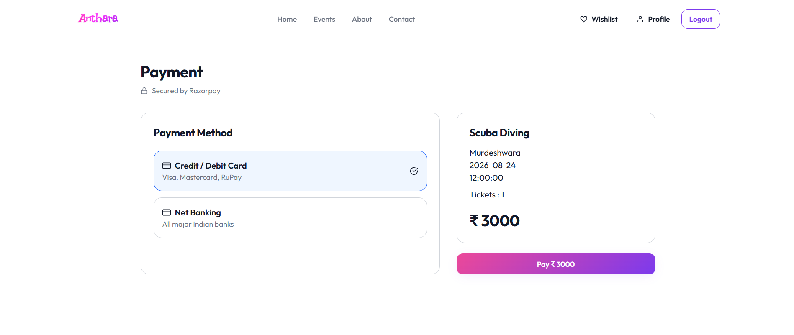
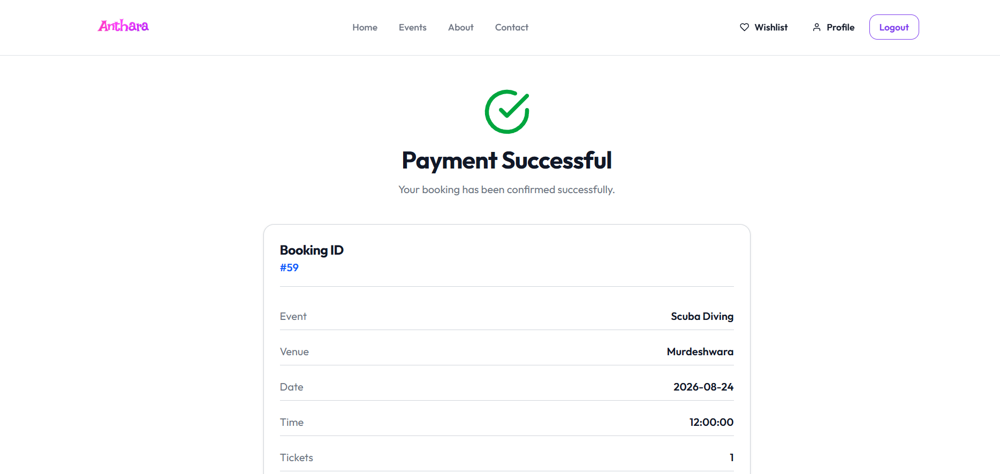
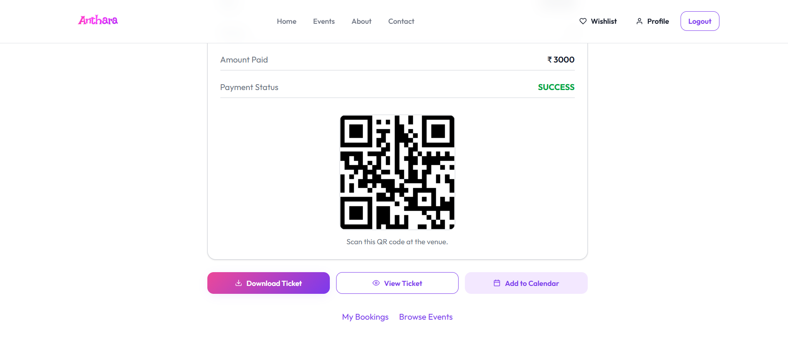

# 🎟️ Anthara

<div align="center">

## Modern Full-Stack Event Ticket Booking Platform

**Discover • Book • Pay • Download • Verify**


### 🌐 Live Demo

https://anthara.anthara.workers.dev

</div>

---

# 📖 About

Anthara is a modern **Full-Stack Event Ticket Booking Platform** built using **React, Java Servlets, JSP, MySQL, Railway, Cloudflare Workers, Razorpay and Brevo API**.

The platform enables users to discover events, securely book tickets, complete online payments, receive email confirmations, download PDF tickets, verify QR tickets and manage bookings through a clean and responsive interface.

---

# ✨ Features

## 👤 User Module

- User Registration
- Secure Login
- BCrypt Password Encryption
- Forgot Password (OTP Verification)
- Profile Management

## 🎉 Event Module

- Browse Events
- Search Events
- Event Details
- Wishlist
- Ticket Booking
- Booking History
- Booking Cancellation

## 💳 Payment Module

- Razorpay Integration
- Secure Payment Verification
- Order Creation

## 📧 Email Module

- OTP Email
- Booking Confirmation
- Cancellation Email
- Newsletter Subscription
- Contact Form

## 🎟 Ticket Module

- PDF Ticket Download
- QR Code Generation
- QR Ticket Verification
- Calendar (.ics) Download

## 👨‍💼 Admin Module

- Secure Admin Login
- Dashboard
- Event Management
- Booking Management
- User Management
- Analytics

---

# 🚀 Tech Stack

| Category | Technologies |
|-----------|--------------|
| Frontend | React, Vite, HTML5, CSS3, JavaScript |
| Backend | Java, Java Servlets, JSP, Maven |
| Database | MySQL |
| Payment | Razorpay |
| Email | Brevo API |
| Frontend Hosting | Cloudflare Workers |
| Backend Hosting | Railway |

---

# 🏗 System Architecture



---

# 📂 Project Structure

```text
Anthara
│
├── Frontend/
│   ├── src/
│   ├── public/
│   ├── package.json
│   └── vite.config.js
│
├── src/
│   └── main/
│       ├── java/
│       ├── resources/
│       └── webapp/
│
├── pom.xml
├── Dockerfile
├── LICENSE
├── README.md
└── .gitignore
```

---

# 🚀 Getting Started

## Clone Repository

```bash
git clone https://github.com/ITSMEANVITH/Anthara.git
```

## Backend

```bash
mvn clean install
```

Deploy the generated WAR file on Apache Tomcat.

## Frontend

```bash
npm install
npm run dev
```

---

# 🌍 Deployment

| Component | Platform |
|-----------|----------|
| Frontend | Cloudflare Workers |
| Backend | Railway |
| Database | MySQL |
| Payment Gateway | Razorpay |
| Email Service | Brevo API |

---

## 📸 Screenshots

### 🏠 Home


### 🎉 Events


### 🎟 Booking


### 💳 Razorpay


### 💰 Payment Option


### ✅ Payment Successful


### 📱 QR Ticket


---

# 🔥 Highlights

- Modern Responsive UI
- Secure Authentication
- REST API Architecture
- Online Payments
- Email Notifications
- QR Ticket Verification
- PDF Ticket Generation
- Calendar Integration
- Admin Dashboard
- Production Deployment

---

# 🚀 Future Enhancements

- Seat Selection
- Google Login
- AI Event Recommendations
- Event Categories
- Mobile Application
- Push Notifications
- Dark Mode
- Reviews & Ratings

---

# 👥 Contributors

<table>
<tr>

<td align="center" width="50%">

<a href="https://github.com/RanjithaSShetty05">

</a>

## Ranjitha S Shetty

**Frontend Developer & UI/UX Designer**

- React Frontend Development
- UI/UX Design
- Responsive User Interface
- Frontend Components
- User Experience Design

<a href="https://github.com/RanjithaSShetty05">GitHub Profile ↗</a>

</td>

<td align="center" width="50%">

<a href="https://github.com/ITSMEANVITH">

</a>

## Anvith C D

**Backend Developer**

- Java Backend Development
- REST API Development
- MySQL Database Design
- Authentication System
- Razorpay Integration
- Brevo Email Integration
- Railway Deployment
- System Integration

<a href="https://github.com/ITSMEANVITH">GitHub Profile ↗</a>

</td>

</tr>
</table>

---

# 🎓 Academic Information

**Institution**

K S Institute of Technology

**Department**

Computer Science and Design (CSD)

---

# 🌐 Links

### Live Website

https://anthara.anthara.workers.dev

### GitHub Repository

https://github.com/ITSMEANVITH/Anthara

---

# ⭐ Support

If you found this project useful, consider giving it a ⭐ on GitHub.

---

# 📄 License

This project is licensed under the **MIT License**.

See the **LICENSE** file for more information.

---

<div align="center">

## ❤️ Developed By

### 🎨 Ranjitha S Shetty
Frontend Developer & UI/UX Designer

### ⚙️ Anvith C D
Backend Developer

**K S Institute of Technology**

**Computer Science and Design**

</div>
